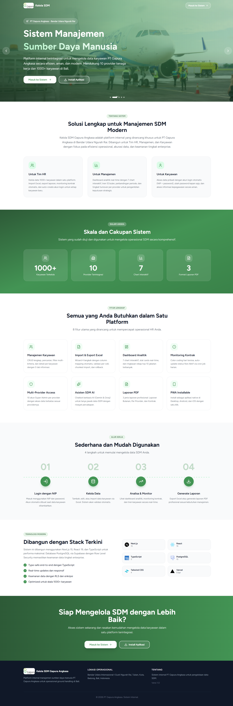
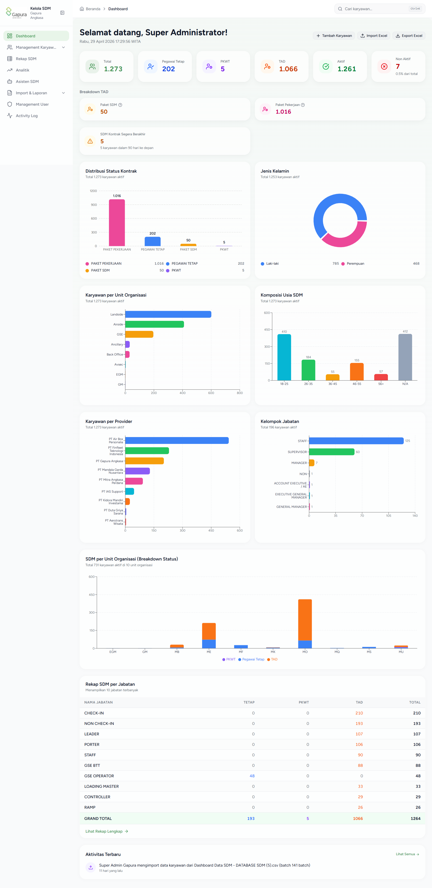
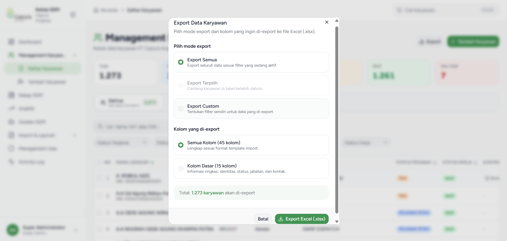
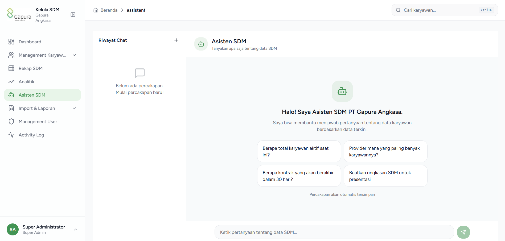

<div align="center">

# Kelola SDM Gapura Angkasa

**Human Resource Management System for PT Gapura Angkasa**

[](https://nextjs.org/)
[](https://react.dev/)
[](https://typescriptlang.org/)
[](https://supabase.com/)
[](https://tailwindcss.com/)


An integrated internal web application to manage employee data of PT Gapura Angkasa at I Gusti Ngurah Rai International Airport. Supporting 1,273+ employees, 10 labor providers, with a real-time analytic dashboard, AI assistant, automated contract monitoring, and PDF reports. Built with a modern Next.js 15 + Supabase stack, fully production-ready, and PWA-installable across all devices.



</div>

---

## Why Kelola SDM Gapura Angkasa?

- **Production-Ready** — Already deployed to Vercel, actively used to manage 1,273+ active employee records at Ngurah Rai Airport.
- **Multi-Provider Architecture** — 10 Super Admin accounts per provider with scoped data access, plus 1 master account for full access.
- **AI-Powered** — AI-driven HR Assistant (Gemini -> Groq waterfall) for answering queries about employee data with persistent conversation history.
- **Comprehensive HR Operations** — Full employee CRUD, Excel import/export via a 4-step wizard, automated contract monitoring, 7 analytic charts, and 3 types of PDF reports.
- **Indonesia-First** — Entire interface is in Bahasa Indonesia, timezone WITA (Asia/Makassar), integrated with Indonesian corporate HR data formats.
- **Enterprise-Grade Security** — Row Level Security applied across 7 tables, JWT auth via Supabase, role-based access control, and comprehensive activity logging.

---

## Highlights

- **Smart Import Wizard** — 4-step flow (Upload -> Mapping -> Preview -> Import) featuring automatic column mapping (fuzzy matching), per-cell validation, chunked processing (10 rows per batch to prevent timeouts), and 1-click rollback.
- **Real-Time Contract Monitoring** — Color-coded badges (green >90 days, yellow 30-90 days, red <30 days) with automated status updates to 'Inactive' via a daily cron job.
- **Multi-Provider Super Admin** — 10 Super Admin accounts (1 per provider) with automatic data scoping, plus 1 master account with full system access.
- **AI Assistant with Provider Waterfall** — Gemini 2.5 Flash as primary with Groq Llama 3.3 70B fallback to ensure high availability on free tiers, with permanently saved conversation history.
- **7 Interactive Charts** — Distribution of contract status, gender, age composition, job groups, organizational units, providers, and a stacked bar chart per unit.
- **Auto-Create Login Accounts** — Every added employee (via import or manual form) automatically receives a login account with the password set to their NIP (Employee ID).
- **PDF Report Generation** — 3 professional report types (Monthly, Per Provider, Contract) generated using jspdf + autotable.
- **PWA Installable** — Service worker + manifest + offline cache + install button with platform detection (Desktop/Android/iOS).
- **HR Recap Pivot Table** — Pivot table showing HR count per job title broken down by employee status, featuring a sticky Grand Total and Excel export.
- **Production-Grade UX** — Skeleton loading, empty states, error boundaries, dynamic breadcrumbs, global search via Ctrl+K, and a collapsible sidebar.

---

## Screenshots

<div align="center">

### Dashboard


### Import Excel Wizard
4-step wizard for employee data import: Upload -> Mapping -> Preview -> Import. Each step features visual indicators, per-cell validation, and chunked processing to prevent production timeouts.



### AI Assistant (HR Assistant)
AI-powered chatbot for Q&A regarding HR data. Supports Gemini as the primary provider with Groq as a fallback. Conversation history is permanently stored in the database, with rename and delete capabilities.



</div>

---

## Features

### Employee Management
- **Full CRUD** — List view with search, multi-criteria filtering (employee status, organizational unit, provider, work status), column sorting, and server-side pagination.
- **Employee Details** — 5 information tabs: Personal Data, Employment, Education, Administration, and Uniform Data.
- **Multi-Section Form** — Tab navigation with dot indicators for missing required fields, cascading Organizational Unit dropdowns, and real-time unique NIP validation.
- **Auto-Create Account** — Every new employee (imported or manual) automatically gets a login account with the password set to their NIP.

### Excel Import & Export
- **4-Step Wizard** — Upload, Mapping, Preview, Import with responsive visual step indicators.
- **Automatic Column Mapping** — Fuzzy matching with the ability to manually override if Excel headers differ.
- **Per-Cell Validation** — Highlights errors per cell (not per row), with 4 summary cards (Valid, Error, Update, New) and 4 filter tabs.
- **Duplicate Detection** — Automatic detection of duplicate NIP/NIK (ID numbers) within the CSV file prior to import.
- **Chunked Processing** — Data is split into batches of 10 rows per request to avoid Vercel timeouts.
- **Real-Time Progress** — Progress bar per batch with duration logs and success/failure counts.
- **Rollback** — Cancel the last import, removing the created data and accounts in one click.
- **Error Reporting** — User-friendly error messages categorized by type (Duplicate NIK, Duplicate Email, Invalid Format, etc.), detailing the issue and suggesting fixes.
- **Selective Export** — Select specific columns via checkboxes, filter by status or provider.

### Dashboard & Analytics
- **7 Stat Cards** — Total, Permanent Employees, PKWT (Contract), TAD (Outsourced), Active, Inactive, Expiring Contracts with percentages.
- **7 Interactive Charts** — Contract Status Distribution, Gender, Age Composition, Job Groups, Organizational Units, Providers, and Stacked Bar per Unit.
- **Real-Time Clock** — Clock displaying seconds in WITA (Central Indonesia Time) timezone.
- **Top 10 Roles** — HR recap summary directly on the dashboard.
- **Activity Feed** — 5 most recent activity logs.
- **Trend Analytics** — Analytics page featuring 12-month trends, period comparisons (this month vs last month), and turnover rates per provider.

### Contract Monitoring
- **Color-Coded Badges** — Green (>90 days), yellow (30-90 days), red (<30 days), gray (expired), dashed (no contract).
- **Tab Filters** — All, Expiring (90 days), Expired.
- **Auto-Update via Cron** — Daily GitHub Actions cron job (00:00 WITA) updates status to 'Inactive' if a contract has expired.
- **Detail Badge** — Remaining contract days are also displayed in the employee detail header and the Work End Date section.

### AI & Reports
- **AI Assistant (HR Assistant)** — Chatbot featuring a provider waterfall (Gemini 2.5 Flash -> Groq Llama 3.3 70B), persistent conversation history, rename/delete conversation options, and a mobile drawer UI.
- **3 PDF Reports** — Monthly Report, Per Provider Report, and Contract Report using jspdf + autotable.
- **Pivot Table Recap** — HR count per Job Title broken down by Employee Status, with sorting, searching, sticky Grand Total, and Excel export.

### Multi-Provider & Security
- **11 Super Admin Accounts** — 1 master + 10 per provider with automatic data scoping.
- **Role-Based Access** — Super Admin, Admin, and Staff with distinct permissions.
- **Row Level Security** — Active RLS on 7 main tables.
- **Activity Log** — Tracks every activity (create, update, delete, import, export, login) with WITA timestamps and filtering.
- **Change Password** — Users can change their own password after their first login.

### UX
- **Landing Page** — 5-image hero carousel with auto-play, 7 professional sections (About, Stats, Features, Workflow, Tech Highlights, CTA), animated counters, and scroll reveal animations.
- **Collapsible Sidebar** — 256px <-> 64px with user-saved preferences.
- **Global Search** — Ctrl+K shortcut for quick searching from anywhere.
- **Skeleton Loading & Empty States** — Professional loading indicators and friendly UI when data is empty.
- **Error Boundaries** — User-friendly error (500) and not-found (404) pages.
- **Responsive Design** — Optimized for Desktop, Tablet, and Mobile.

### PWA
- **Installable** — Service worker + manifest + offline cache.
- **Multi-Platform** — Install button with platform detection (Desktop, Android, iOS) and a manual guide fallback.
- **Native Experience** — Standalone mode hiding the browser bar after installation.

---

## Tech Stack

### Frontend
| Technology | Purpose |
|---|---|
| **Next.js 15** (App Router) | Fullstack framework with RSC, Server Actions, streaming |
| **React 19** | UI library with Server Components and Suspense |
| **TypeScript 5** | End-to-end type safety (strict mode) |
| **Tailwind CSS 4** | Utility-first styling |
| **shadcn/ui** | Accessible, customizable component library |
| **Framer Motion** | Animations (scroll reveal, hero carousel, micro-interactions) |
| **Embla Carousel** | Hero carousel with auto-play on the landing page |
| **Zustand** | Client state management (sidebar, filters, modals) |
| **TanStack Query v5** | Server state, caching, background refetching |
| **Recharts** | 7 interactive charts for the dashboard |
| **SheetJS (xlsx)** | Excel processing for import/export |
| **jsPDF + autotable** | PDF generation for 3 report types |
| **Lucide React** | Consistent and tree-shakeable icons |
| **date-fns** | Date formatting with Indonesian locale |

### Backend & Database
| Technology | Purpose |
|---|---|
| **Supabase** | PostgreSQL + Auth (NIP-based) + Storage + Row Level Security |
| **Drizzle ORM** | Type-safe SQL with auto-migrations |
| **Zod** | Runtime + compile-time validation |

### AI
| Technology | Purpose |
|---|---|
| **Google Gemini 2.5 Flash** | Primary AI provider (free tier) |
| **Groq Cloud** | Fallback AI provider (Llama 3.3 70B) |

### Infrastructure
| Technology | Purpose |
|---|---|
| **Vercel Hobby** | Hosting + CDN + Serverless Functions |
| **GitHub Actions** | CI/CD + 2 cron jobs (contract auto-update, Supabase keep-alive) |
| **PWA** | Service worker + manifest + offline cache |

---

## Architecture

```
+--------------------------------------------------+
|               CLIENT (Browser / PWA)             |
|  Next.js 15 + React 19 + TypeScript              |
|  Tailwind CSS 4 + shadcn/ui + Framer Motion      |
|  Zustand + TanStack Query                        |
|  Recharts + SheetJS + jsPDF                      |
+--------------------------------------------------+
|              SERVER (Vercel Serverless)          |
|  Server Components + Server Actions              |
|  Drizzle ORM + Zod validation                    |
|  Gemini -> Groq (AI waterfall)                   |
+--------------------------------------------------+
|             BACKEND SERVICES (Supabase)          |
|  PostgreSQL + Auth + Row Level Security          |
|  7 tables with RLS policies                      |
+--------------------------------------------------+
|              CRON & DEPLOYMENT                   |
|  GitHub Actions (cron-contract-status,           |
|                  supabase-keepalive)             |
|  Vercel Hobby (auto-deploy from main branch)     |
+--------------------------------------------------+
```

Key data flows:

- **NIP-Based Auth** — Login using NIP as the username, default password = NIP. Mapped to Supabase Auth via internal email format `${nip}@gapura.internal`.
- **Chunked Import** — Excel files are parsed in the browser via SheetJS, then split into 10-row batches and sent serially to the API to avoid Vercel's 60s timeout.
- **AI Waterfall** — Gemini serves as primary, Groq as a fallback if Gemini errors/timeouts occur (10s per provider).
- **Cron Jobs** — GitHub Actions trigger 2 endpoints daily: contract status update (00:00 WITA) and database ping (12:00 UTC).
- **Multi-Provider Scoping** — Super Admins per provider are automatically filtered based on the `provider` column in every database query.

---

## Database

7 main tables with Row Level Security (RLS):

- **`employee`** — Main employee data table (45+ columns: personal, employment, education, administrative, physical & uniform data).
- **`user`** — User login accounts (linked to `employee.nip` and `auth.users`).
- **`organization`** — Master data for organizational units.
- **`unit` & `sub_unit`** — Cascading dropdowns for Organizational Units.
- **`activity_log`** — Logs of all user activities.
- **`import_log`** — Excel import history with rollback metadata.

Plus supporting tables for the AI assistant:
- **`conversation`** — AI conversation history per user.
- **`chat_message`** — Messages within a conversation with role assignments (user/assistant).

---

## Project Status

Production-ready and actively used to manage HR data for PT Gapura Angkasa Bali.

| Phase | Description | Status |
|---|---|---|
| **P1** | Foundation — Auth, Employee CRUD, Dashboard | Complete |
| **P2** | Import/Export Excel + Activity Log + User Management | Complete |
| **P3** | Multi-Provider Super Admin + Contract Monitoring + Cron | Complete |
| **P4** | Dashboard Charts + HR Recap Pivot + UI Polish | Complete |
| **P5** | Analytics + PDF Reports + AI Assistant | Complete |
| **P6** | Polish — Responsiveness, Skeletons, Error Boundaries, PWA | Complete |
| **P7** | Import Wizard Redesign — 4-step, Mapping, Chunked, Rollback | Complete |
| **P8** | Landing Page Redesign — Hero Carousel, 7 Sections | Complete |

**Total**: 1,273+ employees managed, 11 active Super Admin accounts, 16+ pages, 7 database tables, PWA installable on Desktop/Android/iOS.

---

## Getting Started

### Prerequisites
- Node.js 18+
- npm or pnpm
- [Supabase](https://supabase.com/) account (free tier)
- API keys: [Gemini](https://aistudio.google.com/) and [Groq](https://console.groq.com/) for AI Assistant (optional)

### Installation

```bash
# Clone repository
git clone https://github.com/manrandomside/kelola-sdm-gapura-angkasa.git
cd kelola-sdm-gapura-angkasa

# Install dependencies
npm install

# Setup environment variables
cp .env.example .env.local
# Edit .env.local with your credentials

# Run database migrations
npm run db:migrate

# Start development server
npm run dev
```

### Environment Variables

```env
# Supabase
NEXT_PUBLIC_SUPABASE_URL=your_supabase_url
NEXT_PUBLIC_SUPABASE_ANON_KEY=your_anon_key
SUPABASE_SERVICE_ROLE_KEY=your_service_role_key
DATABASE_URL=your_database_url

# AI Providers (optional, for HR Assistant)
GEMINI_API_KEY=your_gemini_key
GROQ_API_KEY=your_groq_key

# App
NEXT_PUBLIC_APP_URL=http://localhost:3000
```

### Default Login (Production)

| NIP | Password | Access |
|---|---|---|
| `SUPERADMIN` | `SUPERADMIN` | Master (all providers) |
| `SUPERADMIN_GAPURA` | `SUPERADMIN_GAPURA` | PT Gapura Angkasa |
| `SUPERADMIN_AIRBOX` | `SUPERADMIN_AIRBOX` | PT Air Box Personalia |

10 Super Admin accounts are available, 1 for each labor provider. See the User Management page in production for the full list.

---

## License & Usage

This project is an **internal HR system** developed for **PT Gapura Angkasa** (I Gusti Ngurah Rai International Airport, Bali). All Rights Reserved.

- **Employee data** is the property of PT Gapura Angkasa and is not included in this repository.
- **PT Gapura Angkasa logo and branding** are trademarks of PT Gapura Angkasa - please do not reuse them for derivative products.
- This repository is shared as a **portfolio demonstration** of fullstack engineering capabilities — not licensed for production reuse.

### Inquiries

For licensing questions or contributions: [GitHub Issues](https://github.com/manrandomside/kelola-sdm-gapura-angkasa/issues)

---

<div align="center">

Built by [@manrandomside](https://github.com/manrandomside) — A fullstack portfolio project demonstrating production-grade Next.js + Supabase development for enterprise HR operations.

</div>
